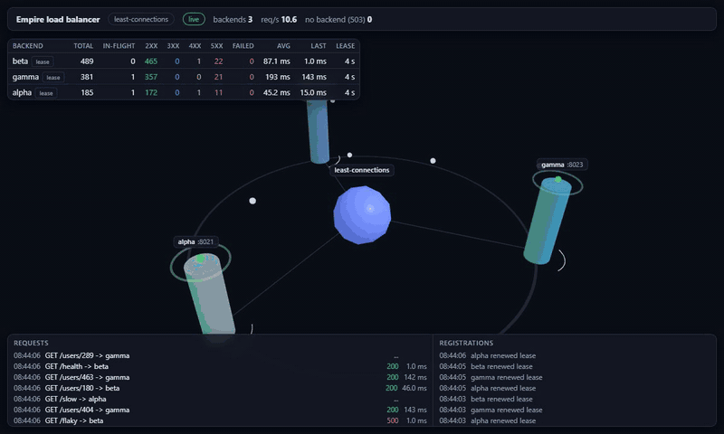

# Empire

[](https://github.com/rom399/Empire/actions/workflows/ci.yml)

A lightweight TypeScript web framework built from scratch on Node's `http` module. Routing, a middleware pipeline, a Context API, static file serving, dependency injection, and centralized error handling - all with zero runtime dependencies. Schema-based validation accepts any [Standard Schema](https://standardschema.dev) validator - [Zod](https://zod.dev), Valibot, ArkType or a hand-written one - so you bring your own and Empire depends on none of them - the repository contains no validation library at all. See [Using Zod](src/empire/README_DEVELOPMENT.MD#using-zod) for how to add one, and [`doc/features/REMOVE_ZOD.md`](src/empire/doc/features/REMOVE_ZOD.md) for why.

Empire exists to answer a question that using a framework never does: what is actually happening between the socket and your handler? Express, Koa, Fastify, and ASP.NET Core all solve the same problems in recognisably similar ways, and the fastest way to understand those solutions is to build them. Every feature here is implemented directly against Node's `http` module rather than wrapped around an existing library.

## Features

- HTTP server on Node's `http` module, with configurable host and port
- Promise-based `start()` and `stop()` lifecycle
- Routing across all six HTTP methods, with `:param` capture and automatic HEAD and OPTIONS handling
- Middleware pipeline executing in registration order (`app.use()`)
- Static file serving, with optional URL prefixes and SPA fallback
- A hand-rolled dependency injection container - singleton/scoped/transient lifetimes, disposal, graceful shutdown
- Schema-based request validation (body, query, route params) via `validate()`, working with any Standard Schema validator (Zod, Valibot, ArkType, or your own)
- A small layer-7 load balancer - backends that register themselves, round robin or least connections, and a live 3D dashboard
- Centralized error handling built around `HttpError`
- Configurable request body size limit
- Pluggable logging abstraction (`ILogger`), with a built-in console logger

## Quick start

```bash
cd src/empire
npm install
npm start
```

`npm start` runs `examples/01-basic-server/server.ts`. There is no
standalone server file at the project root - see Examples below for what
else is available.

```typescript
import { Empire } from "./src/Empire";

const app = new Empire({
    host: "localhost",
    port: 8008
});

app.get("/", (ctx) => {
    ctx.html(`
        <!DOCTYPE html>
        <html>
            <head>
                <title>Empire</title>
            </head>
            <body>
                <h1>Welcome to Empire</h1>
                <p>A lightweight TypeScript web framework.</p>
            </body>
        </html>
    `);
});

await app.start();
```

## Load balancer

Empire can also act as a small reverse proxy. Backends register themselves with the balancer and hold a lease, so starting one adds it to the rotation and killing one drops it out on its own, with no config to edit. Requests go to backends by round robin or by least connections (the backend with the fewest requests in flight), and a live three.js dashboard shows every request as it flies from the balancer to the backend that served it, with a drill-down into each backend's routes and calls.



It is a learning and local-development tool, not a production edge - no TLS, no HTTP/2, no WebSocket upgrades, no retries - and registration is token-protected and loopback-only by default. To see it running, start the balancer, a few backends and some traffic from `src/empire`:

```bash
npx tsx examples/12-load-balancer/server.ts
```

The [example's header comment](src/empire/examples/12-load-balancer/server.ts) has the full walkthrough, and the [Load Balancer section of README_DEVELOPMENT.MD](src/empire/README_DEVELOPMENT.MD#load-balancer) covers the details.

## Documentation

The framework source and its full documentation live in [`src/empire`](src/empire).

* **[README_DEVELOPMENT.MD](src/empire/README_DEVELOPMENT.MD)** - the full documentation: routing, middleware, static files, error handling, logging, request body limits, and more, each with worked examples. Start here to build or contribute to Empire itself.
* **[README.MD](src/empire/README.MD)** - installing and using the published `empire-ts` npm package. This is also the README bundled with the package on npm.

## Examples

Twelve runnable examples live in [`src/empire/examples`](src/empire/examples), each covering one feature - routing, middleware, static files, error handling, a React SPA, body size limits, authentication, dependency injection, validation, CORS, and a load balancer. **These are for developers extending Empire itself** - they import the source tree directly. See the [Examples section of README_DEVELOPMENT.MD](src/empire/README_DEVELOPMENT.MD#examples) for the complete list with ports and descriptions.

```bash
cd src/empire
npx tsx examples/02-routing/server.ts
```

If you just want to know how to *use* the published `empire-ts` npm package rather than extend Empire itself, see [`src/empire/package-example`](src/empire/package-example) instead - it mirrors the first eleven examples above against a real installed `empire-ts`, importing `"empire-ts"` rather than the source tree.

## Repository layout

```
Empire/
├── .github/          CI workflow and Dependabot config
├── src/empire/       Framework source, tests, examples, and full documentation
└── README.md         You are here
```

## Status

Empire is under active development and is not published to npm. The API is not yet stable and may change between commits.

## License

MIT. See [LICENSE](LICENSE).
